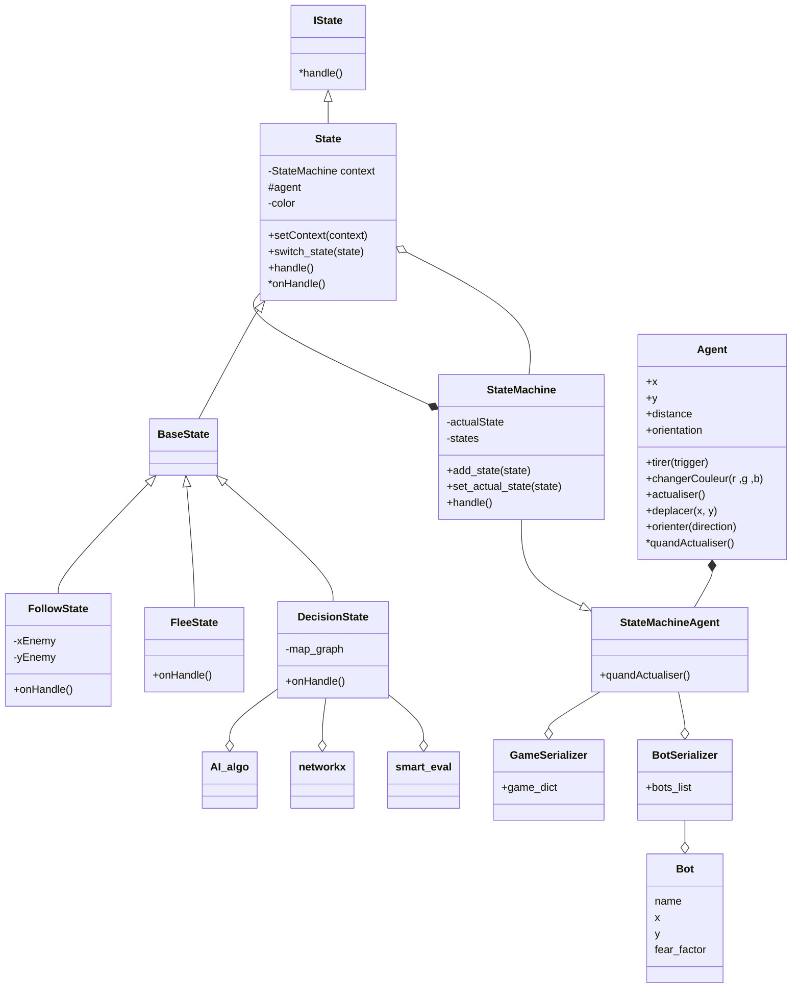
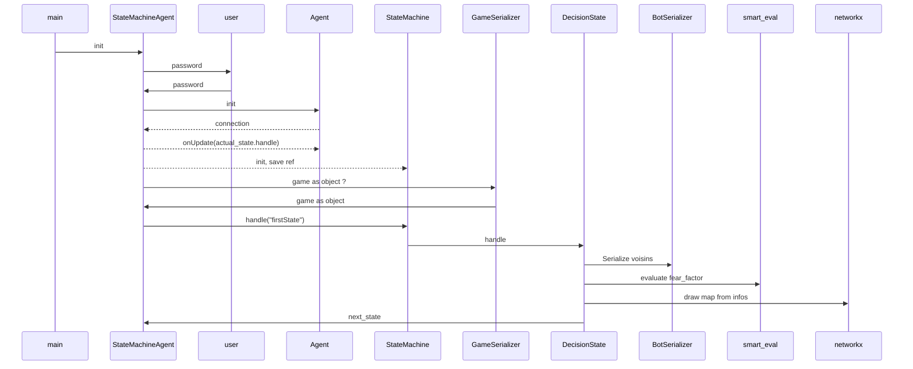
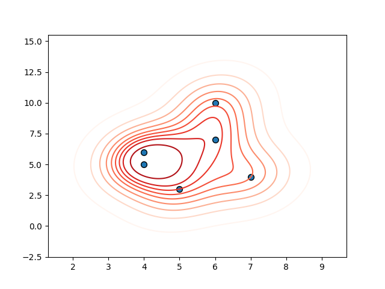

# AI TRAINING

Training with psycopg2 and pytactx

## Pytactx :

    Is a library developpeded by jusdeliens.
    -> allows us to capture images from a tiny bot.
    -> we need to annalyse the image to calculate Next Move.
    -> control this bot accordingly to the images received.

    Python Tactic Matrix abreviation. Developped by jusdeliens.
    This lib allows us to connect to a remote Bot Arena.
    The goal with this one is to elaborate a Bot with pre-defined behaviours, in order to be the last one standing.

## ⚙️ Setup

1. Clone this repo
2. Update all submodules recursively : `git submodule update --init --recursive`
```
git submodule update --init --recursive
```

3. `python -m venv venv` pour initier un environnement virtuel, pour les dépendences

4. pip install all deps in [the requirement list](requirements.txt)
```
pip install --no-cache-dir -r requirements.txt
```
5. Add a .env file in the root project directory, containing the following credentials. If you don't have any credentials, feel free [to contact us](https://jusdeliens.com/contact) to join the adventure 🚀
```.env
# The name of your player or your robot ID as str
ROBOTID         = ...
# The name of the arena to join as str
ARENA           = ...
# The broker user name provided by a Jusdeliens administrator as str
USERNAME        = ...
# The broker user password as str
PASSWORD        = ...
# The broker ip address or dns as str
BROKERADDRESS   = ...
# The broker port as int 
BROKERPORT      = ...
# Verbosity level as int from 0:no log, to 4: full debug logs
VERBOSITY       = ... 
```


## Goals of the exercice:

We aim to fight in a battle royal arena.
The goal is to be the last one standing. Therefore, we must implement different behaviors (States) in order to survive

#### mermaid/OOP reminders



# Embranchement des classes de manière temporelle



# When we are required to decide on next move (State switch)

We first draw a heat-map depending on each enemy location and his score.
the plot color depends on player's score
the red area represents a danger zone. Avoid as much as possible



If we are in a red area and a non-red area is possible to flee to, flee
If we are required to flee, we aim to escape the red area
