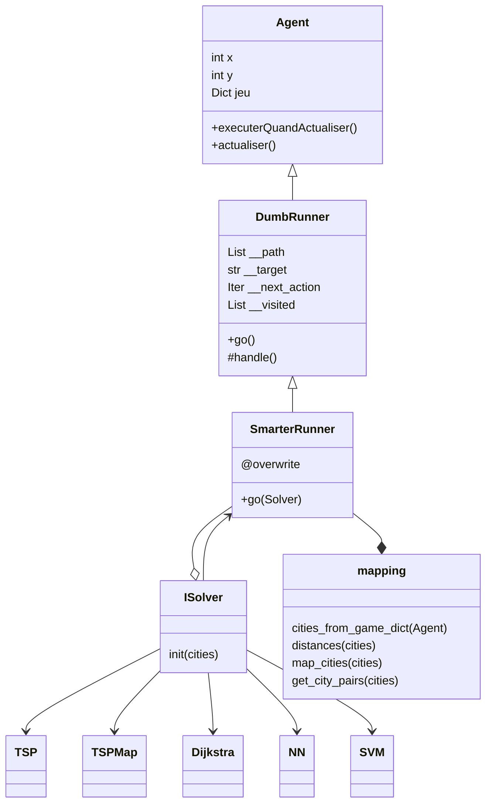

# Runner Bot

The goal for this bot is to race against others.

The map, of variable size (default 30*30) contains a random number of cities (default 10)

Our bot spawns randomly near a game-chosen city

As usual, we use pytactx to visualize our progresses when our tests satisfies us.

# Class Diagram

